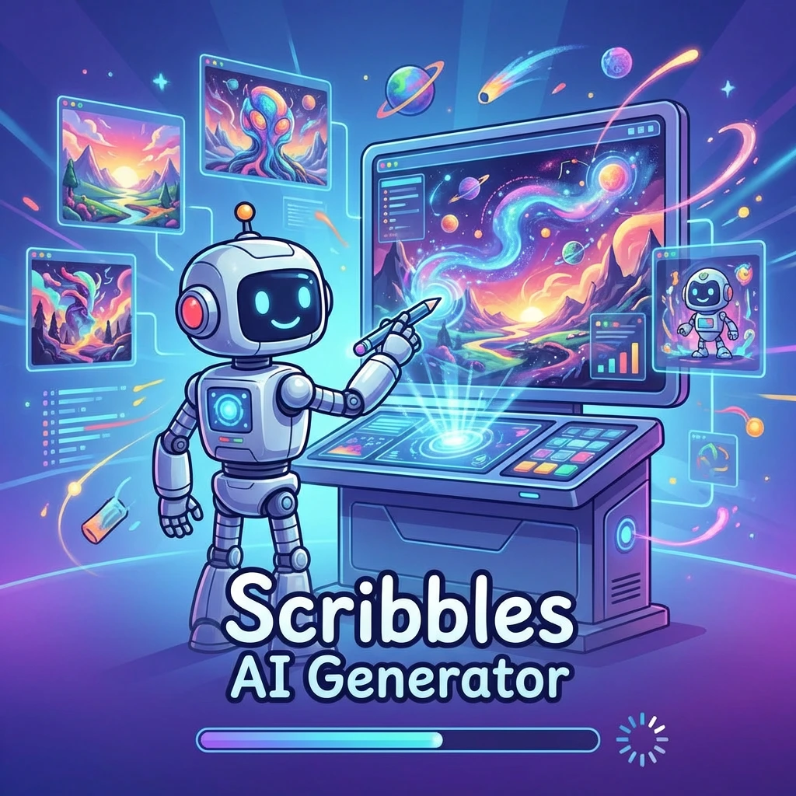

# Scribbles - AI Image Generator

<p align="center">
  
</p>

Scribbles is a modern AI-powered image generation application built with React. Generate stunning images using state-of-the-art AI models through an intuitive chat-based interface.

## Features

- **AI Image Generation** - Create images from text prompts using advanced AI models
- **Chat-Based Interface** - Natural conversational workflow for image creation
- **Image Editing** - Edit and modify existing images with AI assistance
- **Image Conversion** - Convert images between formats (PNG, JPEG, WebP)
- **Gallery Management** - Save, organize, and browse your generated images
- **Favorites** - Mark and quickly access your best creations
- **Multiple AI Models** - Support for various image generation models
- **Customizable Settings** - Adjust aspect ratios, image sizes, and quality
- **Theme Support** - Multiple color themes to choose from
- **Local Storage** - Images stored locally in your browser

## Supported AI Models

| Model | Provider | Description |
|-------|----------|-------------|
| Gemini 3 Pro | Google | Advanced multimodal image generation |
| GPT-5 Image Mini | OpenAI | Fast, high-quality image generation |
| Gemini 2.5 Flash Image | Google | Efficient image generation |

## Getting Started

### Prerequisites

- Node.js 18+ 
- npm or yarn
- OpenRouter API key (free)

### Installation

1. Clone the repository:
```bash
git clone https://github.com/Vistiqx/scribbles.git
cd scribbles
```

2. Install dependencies:
```bash
npm install
```

3. Copy the environment file:
```bash
cp .env.example .env
```

4. Add your OpenRouter API key to `.env`:
```
VITE_OPENROUTER_API_KEY=your_api_key_here
```

Get your free API key at: https://openrouter.ai/

5. Start the development server:
```bash
npm run dev
```

6. Open http://localhost:5173 in your browser

### Building for Production

```bash
npm run build
```

The built files will be in the `dist` directory.

## Usage

### Generating Images

1. Enter a text prompt describing the image you want to create
2. Adjust settings (aspect ratio, quality, image size) as needed
3. Press Enter or click the generate button
4. View and download your generated image

### Image Editing

1. Click on any generated image to open the editor
2. Choose a mode: Variations, Inpainting, or Outpainting
3. Adjust settings and regenerate

### Converting Images

1. Navigate to the Convert tab
2. Drag and drop or select images
3. Choose output format (PNG, JPEG, WebP)
4. Adjust quality if needed
5. Convert and download

### Managing Gallery

- All generated images are saved to your gallery automatically
- Use tags to organize images
- Mark favorites for quick access
- Search and filter through your collection

## Project Structure

```
scribbles/
├── public/              # Static assets
│   └── themes/          # Theme JSON files
├── src/
│   ├── components/      # React components
│   │   ├── ChatArea.jsx       # Main chat interface
│   │   ├── ImageConverter.jsx # Image format conversion
│   │   ├── ImageEditor.jsx    # AI image editing
│   │   ├── GalleryModal.jsx   # Image gallery view
│   │   └── ...
│   ├── constants/       # App constants
│   ├── context/        # React context providers
│   │   ├── ChatContext.jsx    # Chat state management
│   │   └── ThemeContext.jsx   # Theme management
│   ├── styles/         # CSS styles
│   ├── utils/         # Utility functions
│   │   ├── api.js           # OpenRouter API integration
│   │   ├── imageConverter.js # Image conversion
│   │   ├── storageManager.js # Local storage
│   │   └── ...
│   ├── App.jsx        # Main app component
│   └── main.jsx       # Entry point
├── .env.example       # Environment variables template
├── package.json       # Dependencies
└── vite.config.js    # Vite configuration
```

## Technologies

- **React 19** - UI framework
- **Vite** - Build tool
- **OpenRouter API** - AI model provider
- **IndexedDB** - Local image storage
- **JSZip** - Batch file handling

## Contributing

Contributions are welcome! Please read our [Contributing Guidelines](CONTRIBUTING.md) before submitting PRs.

## Code of Conduct

Please read our [Code of Conduct](CODE_OF_CONDUCT.md) to keep our community approachable and respectful.

## License

This project is licensed under the MIT License - see the [LICENSE](LICENSE) file for details.

## Documentation

For detailed documentation, see the `docs/` directory:

- [Getting Started](docs/GETTING-STARTED.md) - Step-by-step setup guide
- [Usage Guide](docs/USAGE.md) - Detailed usage scenarios
- [Overview](docs/OVERVIEW.md) - Technical architecture and features

## Acknowledgments

- [OpenRouter](https://openrouter.ai/) for providing AI model access
- [Vite](https://vitejs.dev/) for the excellent build tool
- [React](https://react.dev/) for the UI library

